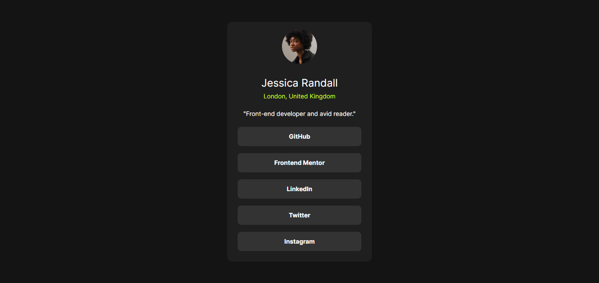

# Frontend Mentor - Social links profile solution

This is a solution to the [Social links profile challenge on Frontend Mentor](https://www.frontendmentor.io/challenges/social-links-profile-UG32l9m6dQ). Frontend Mentor challenges help you improve your coding skills by building realistic projects.

## Table of contents

- [Overview](#overview)
  - [Screenshot](#screenshot)
  - [Links](#links)
- [My process](#my-process)
  - [Built with](#built-with)
- [Author](#author)
- [Acknowledgments](#acknowledgments)

## Overview

### Screenshot

### Links

- Live Site URL: [Live-Site]()

## My process

### Built with

- Semantic HTML5 markup
- Tailwind CSS

## Author

- Frontend Mentor - [@E-R-I-X](https://www.frontendmentor.io/profile/E-R-I-X)

## Acknowledgments

I would like to say a huge thank you to John Smilga as his courses helped me a lot to complete this project.
